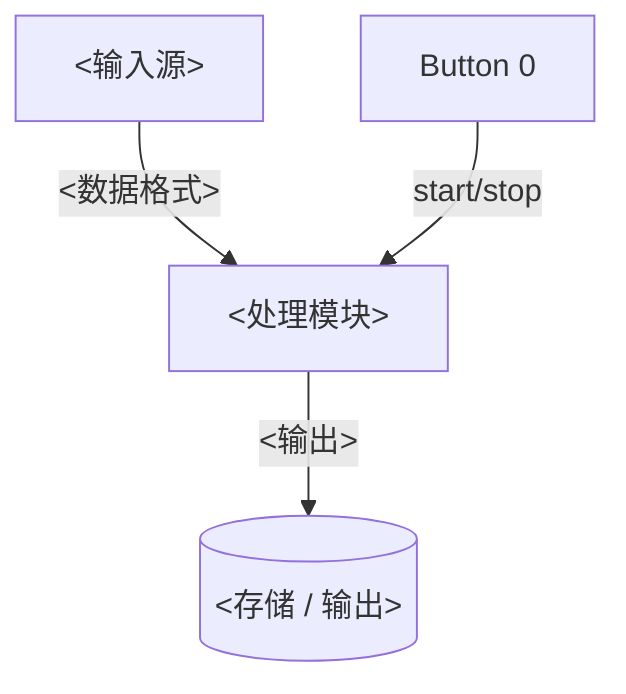

# 双语 README 骨架模板

英文版 `README.md` 骨架如下；中文版结构完全镜像，仅替换语言、开头互链改为 `[English](README.md)`。
按工程实际裁剪，空章节整节删除。

```markdown
# <project_name>

[中文说明](README_zh.md)

<一句话：这是什么 demo，跑在什么 SoC / DK 上>

Environment: nRF Connect SDK vX.Y.Z

## Features

1. <功能 1：一句话说清触发方式和结果>
2. <功能 2>

## Architecture



## Hardware

- **Board**: <DK 名称> (`<qualified board target>`)，<板载关键器件>
- **外接器件**: <型号、数量、可选性>

### Wiring

| DK    | 外设   |
| ----- | ------ |
| P1.xx | <信号> |
| GND   | GND    |

- <供电 / 测量 / 复用注意点>

## Getting the project

<有 submodule / patch 时才保留本节>

```bash
git submodule update --init
```

## Build and flash

```bash
west build -p always -b <board_target> -d build .
west flash -d build
```

<有多个构建变体时各给一组；支持多 board 时加一句：>
> For <另一块板>, just change the board target to `<board_target_2>`.

## Configuration

<关键 Kconfig，注明默认值 / 范围 / 影响>

- `CONFIG_XXX`: default `y`, <作用>
- `CONFIG_YYY`: default `20`, range `0` - `100`, <作用>

<非 Kconfig 配置（devicetree 属性等）说明位置和联动关系>

## Running

1. <上电后的初始状态>
2. **<用户操作>** → <预期现象：LED / 日志 / 文件>
3. <下一步操作与现象>

Expected log:

```text
<真实抓取的 boot log，长日志中间用 ... 截断>
```

## Power measurement

<无功耗评估需求时整节删除>

Measurement procedure:

1. <接线 / 仪器设置>
2. <烧录哪个固件、如何冷启动>
3. <各状态如何触发>

### Power data

<状态描述>：平均 <X> uA，底电流 <Y> uA。

<!-- TODO: 补充 PPK2 实测截图：<测的什么状态>，存为 docs/imgs/<name>.png -->


## Notes

### <设计主题 1>

<为什么这么做：约束来源、坑、替代方案为何不可行。关键代码贴片段并逐条解释>

### <设计主题 2>

## Related links

- [<标题>](<URL>)
```
